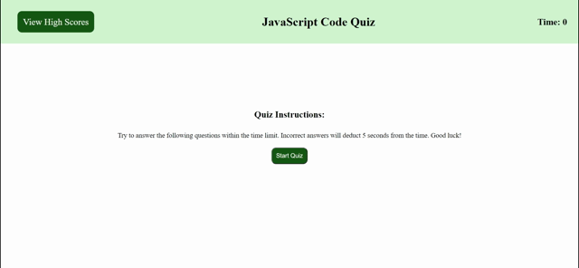

# JavaScript Code Quiz

### Created by Carolyn Hudson

---

## Description:
This application presents users with a timed quiz based on JavaScript fundamentals. Once the "Start" button is pressed, the timer begins. Each incorrect answer deducts 5 seconds from the clock. Each correct answer adds 5 points to the score. When all questions are answered or the timer reaches zero, the user is able to save his or her initials and score. 

---

## Preview:
The following GIF demonstrates the web application's appearance and functionality:

---

## Links:

* GitHub [Repository](https://github.com/cghudson/code-quiz)

* Deployed application [URL](https://cghudson.github.io/code-quiz/) 
